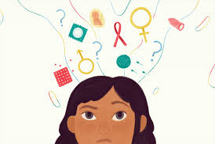
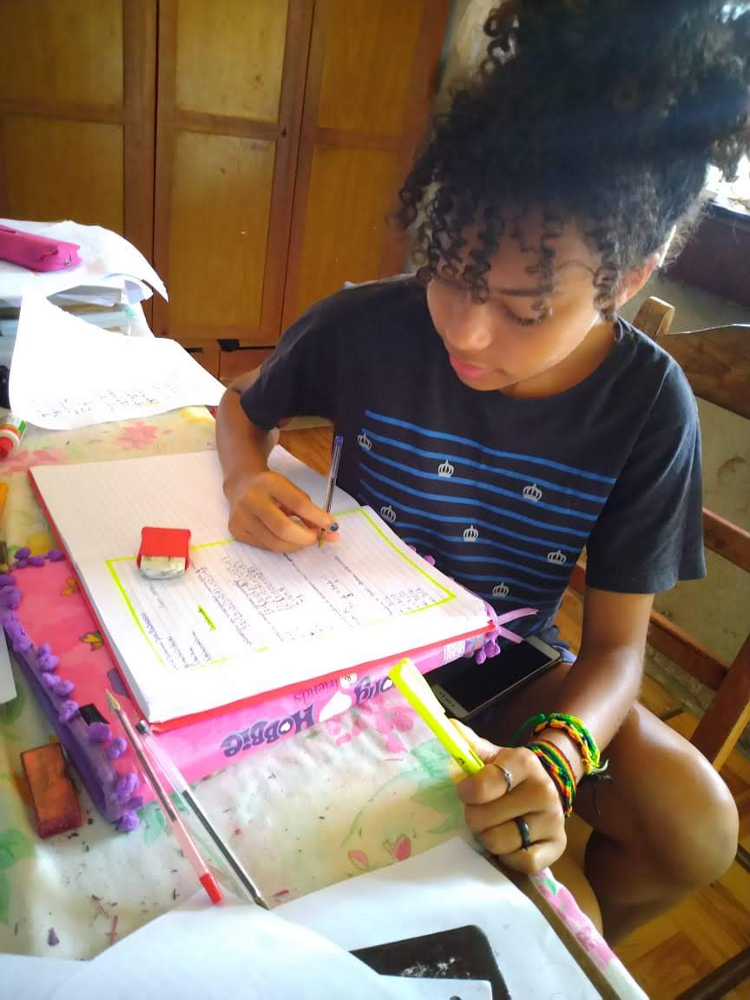

<html>

<head>
<title>Saúde e bem estar</title>
 <link rel="stylesheet" href="estilos2.css">
 <meta charset="utf-8">
 <meta name="viewport" content="width:device-width, initial-scale:1.0">
</head>

<body>
<header>

 
    

    <ul id="menu">
      <li><a href="#oque">O que e educação sexual?</a></li>
      <li><a href="#objetivo">Objetivos Principais</a></li>
      <li><a href="#gravidez">Gravidez na adolescência</a></li>
      <li><a href="#dst">O que são DSTs?</a></li>
    </ul>
  </header>

  

    <h1 id="titulo">Nossa saúde e bem estar</h1>
    <h2 id="subtitulo">Assegurar uma vida saudável e promover o bem-estar para
      todas e todos, em todas as idades.</h2>
    <a id="acao" href="https://nacoesunidas.org/pos2015/ods3/" target="blank">Começar</a>
  

  <section id="projeto.jpg" class="destaque">
    

      <iframe width="560" height="315" src="https://www.youtube.com/embed/-3VpAL5iDfI" frameborder="0" allow="accelerometer; autoplay; encrypted-media; 
                       gyroscope; picture-in-picture" allowfullscreen></iframe>
    

    

      <h2 class="centralizado"> Educação sexual</h2>

      
Até 2030, assegurar o acesso universal aos serviços de saúde sexual e reprodutiva,
        incluindo o planejamento familia
        informação e educação, bem como a integração da saúde reprodutiva em estratégias e programas nacionais.
        Estima-se que 208 milhões de mulheres em idade reprodutiva que são casadas ou estão em união em todo o mundo
        ainda
        não têm suas necessidades de planejamento familiar atendidas com um método contraceptivo moderno. Isso
        representa 23% de todas as mulheres em idade reprodutiva que são casadas ou estão em união e desejam
        limitar ou espaçar gestações. 

    

  </section>

  <section id="selecao">

    <h3>Quebrando os tabus</h3>

    

    <section id="oque">
      <h4>O que e educação sexual?</h4>

      
      
A educação sexual busca ensinar e esclarecer questões relacionadas ao sexo, livre de preconceito e tabus.
        Antigamente e ainda hoje, falar sobre sexo provoca certos constrangimentos em algumas pessoas, mas o tema é de
        extrema importância, pois
        esclarece dúvidas sobre preservativos, DSTs, organismo masculino e feminino, anticoncepcionais e gravidez.

      <section id="objetivo">
        <h4>Objetivo principal</h4>

        
        
O objetivo principal da educação sexual é preparar os adolescentes para a vida sexual de forma segura,
          chamando-os à responsabilidade de cuidar de seu próprio corpo para que não ocorram situações futuras
          indesejadas,
          como a contração de uma doença ou uma gravidez precoce e indesejada.

        <section id="gravidez">
          <h4>Gravidez na adolescência</h4>

          
          
 Adolescência é um período da vida rico em manifestações emocionais, caracterizadas por ambiguidade de
            papéis,
            mudança de valores e dificuldades face à procura de independência pela vida. A gravidez na adolescência é
            muitas vezes encarada de forma negativa do ponto de vista emocional e financeiro
            das adolescentes e suas famílias, alterando drasticamente suas rotinas.
            Maioria das adolescentes que engravida abandona os estudos para cuidar do filho, o que aumenta os riscos
            de desemprego e dependência econômica dos familiares.

          <section id="dst">
            <h4>O que são DSTs?</h4>
            
            
As Doenças Sexualmente Transmissíveis (DST) são transmitidas, principalmente, por contato sexual sem o
              uso
              de camisinha, com uma pessoa que esteja infectada e, geralmente, se manifestam por meio de feridas,
              corrimentos, bolhas ou verrugas.

            
Algumas DSTs, têm tratamento mais difícil ou podem persistir ativas, apesar da sensação de
              melhora relatada pelos pacientes.
              As mulheres, em especial, devem ser bastante cuidadosas, já que, em diversos casos de DST, não é fácil
              distinguir os sintomas das reações orgânicas comuns de seu organismo.
              Podem provocar, assim, a interrupção espontânea da gravidez ou causar graves lesões ao feto, outras
              podem também ser transmitidas por transfusão de sangue contaminado ou compartilhamento de seringas e
              agulhas,
              principalmente no uso de drogas injetáveis.

            <section id="selecao">
              <h4>Tipos de DSTs</h4>
              
              
Aids: causada pela infecção do organismo humano pelo HIV (vírus da imunodeficiência adquirida). O HIV
                compromete o
                funcionamento do sistema imunológico humano, impedindo-o de executar adequadamente sua função de
                proteger o organismo
                contra as agressões externas, tais como: bactérias, outros vírus, parasitas e células cancerígenas;

              
Herpes: manifesta-se através de pequenas bolhas localizadas principalmente na parte externa da vagina e
                na ponta do
                pênis. Essas bolhas podem arder e causam coceira intensa. Ao se coçar, a pessoa pode romper a bolha,
                causando uma ferida;

              
Condiloma acuminado ou HPV: é uma lesão na região genital, causada pelo Papilomavirus Humano (HPV). A
                doença é
                também conhecida como crista de galo, figueira ou cavalo de crista;

              
Dentre outras.

              <section id="selecao">
                <h4>Prevenções</h4>
                
                
O método mais seguro para prevenir contra DSTs e gravidez indesejada, é o uso correto do
                  preservativo.
                  Os postos de saúde distribuem preservativos gratuitamente, e no mercado é possível encontrar uma
                  variedade
                  enorme de modelos, materiais, tamanhos, texturas, espessuras e até cheiros e cores.

                <section id="selecao">
                  <h4>Afetividade e sexualidade</h4>
                  
                  
Sexualidade é um termo amplamente abrangente que engloba inúmeros fatores e dificilmente se encaixa
                    em
                    uma definição única e absoluta.
                    Noção de sexualidade como busca de prazer, descoberta das sensações proporcionadas pelo contato ou
                    toque,
                    atração por outras pessoas (de sexo oposto e/ou mesmo sexo) com intuito de obter prazer pela
                    satisfação
                    dos desejos do corpo, entre outras características, é diretamente ligada e dependente de fatores
                    genéticos
                    e principalmente culturais.

                  
Afetividade é um termo que deriva da palavra afetivo e afeto.
                    No âmbito da psicologia, afetividade é a capacidade individual de experimentar o conjunto de
                    fenômenos
                    afetivos (tendências, emoções, paixões, sentimentos).
                    A afetividade tem um papel crucial no processo de aprendizagem do ser humano, porque está presente
                    em
                    todas as áreas da vida, influenciando profundamente o crescimento cognitivo.
                    Graças à afetividade, as pessoas conseguem criar laços de amizade entre elas e até mesmo com animais
                    irracionais, isto porque os animais também são capazes de demonstrar afetividade uns com os outros e
                    com os seres humanos.

                  
Muitas vezes se confunde o conceito de sexualidade com o do sexo propriamente dito.
                    Cabe a cada um decidir qual o momento propício para que esta sexualidade se manifeste de forma
                    física e
                    seja compartilhada com outro indivíduo através do sexo, que é apenas uma das suas formas de se
                    chegar à
                    satisfação desejada.
                    Sexualidade é uma característica geral experimentada por todo o ser humano e não necessita de
                    relação
                    exacerbada com o sexo, uma vez que se define pela busca de prazeres, sendo estes não apenas os
                    explicitamente
                    sexuais.
                    Pode-se entender como constituinte de sexualidade, a necessidade de admiração e gosto pelo próprio
                    corpo por exemplo, o que não necessariamente signifique uma relação narcísica de amor incondicional
                    ao ego.

                  
O esclarecimento de dúvidas e a capacidade de se sentir vontade com seus desejos e sensações,
                    colabora imensamente ao amadurecimento desta, o que gera sensação de conforto e evita conflitos
                    internos provenientes de dúvidas e medos, gerando uma experiência positiva e saudável.

                  <section id="selecao">
                    <h4>O poder do diálogo</h4>
                    
                    
Muitos pais e responsáveis têm dificuldades para esclarecer assuntos ainda considerados tabus
                      com crianças e adolescentes.
                      Ideal seria que eles fossem educados por suas famílias para que assumissem sua sexualidade de
                      maneira
                      positiva e responsável.
                      Hoje, com a cultura das tecnologias, acredita-se que os jovens estão tendo muita informação,
                      porém, vejo
                      que, muitas vezes, são informações inadequadas ou confusas.
                      O processo educativo deve propiciar um conhecimento de si mesmo, de dentro para fora, num processo
                      de reflexivo.

                    
Não existe um manual sobre como falar de sexo com os filhos.
                      Mas sim, existem dicas, sugestões, e estar sintonizado com o (a) seu
                      (sua) filho (a) é o melhor radar para uma boa comunicação, mesmo que essa seja exigente,
                      constrangedora.
                      Deixar que ele traga suas dúvidas conversando de forma aberta será uma oportunidade para
                      transmitir que ali é um espaço disponível para isso.

                  </section>
                  <section>
                    <section id="saude"></section>
                    

                      <h3>Hospital para gravidez na adolescência</h3>

                      
                      
Ate 2030, garantir que todas as meninas jovens gravidas possam ter um pré-natal e um
                        acompanhamento
                        durante a gravidez.

                    

                    

                      <h3>Hospital para DSTs</h3>

                      
                      
Ate 2030, garantir que todas as pessoas tenham atendimento medico
                        contra as DSTs.

                    

                    

                      <h3>Programas explicam</h3>
                      
                      
Ate 2030 assegurar que os pais possam se informar mais sobre a afenidade e a sexualidade em
                        preogramas
                        para que possam estar falando melhor com seus filhos.
                      

                    

                    <section id="sobre" class="destaque">
                      

                        <h3 class="centralizado">Sobre mim</h3>
                        

                          Raphaella Albuquerque da Silva. Estudante 2°Ano do ensino médio, possuo
                          curso de informatica básica, e computação básica, possuo também curso de inglês
                          básico e intermediário.

                      

                      

                        
                      

                    </section>

                  </section>
                  <footer>
                    

                      <h3>Meu primeiro site</h3>
                      
Projeto desenvolvido durante o curso Meu primeiro site, promovido pela Junior Achievement
                        Brasil e
                        Microsoft.

                    

                    

                      <h3>Créditos</h3>
                      
Ícones de Flat Icon, logo de Logomark, 

                    

                  </footer>
</body>

</html>
